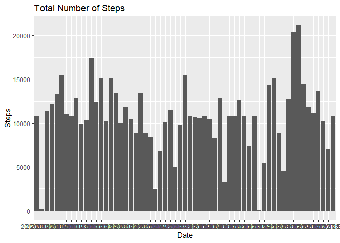

## Loading and preprocessing the data
The data is obtained from a personal activity monitoring device obtained from the "Activity Monitoring data set". The data includes number of steps taken for every 5-minutes interval collected during October and November, 2012.  

We first download and read the CSV data.   

```r
cache = TRUE
download.file("https://d396qusza40orc.cloudfront.net/repdata%2Fdata%2Factivity.zip", "data.zip")
unzip("data.zip")
activity <- read.csv("activity.csv")
```

## What is mean total number of steps taken per day?

  After we read the data, we would like to know the total number of steps taken per day.  

```r
library(reshape2)
```

```
## Warning: package 'reshape2' was built under R version 3.5.1
```

```r
totalstep <- melt(tapply(activity$steps, activity$date, sum, na.rm = TRUE))
colnames(totalstep) <- c("Date", "Steps")
```

  To visualize the data we plot it in a histogram and attach the appropriate lables.

```r
library(ggplot2)
```

```
## Warning: package 'ggplot2' was built under R version 3.5.1
```

```r
ggplot(totalstep,aes(Date, Steps)) + geom_histogram(stat="identity") +labs(title = "Total Number of Steps") 
```

```
## Warning: Ignoring unknown parameters: binwidth, bins, pad
```

<!-- -->

  We then calculate the mean and median of the total number of steps each day.

```r
mean(totalstep$Steps)
```

```
## [1] 9354.23
```

```r
median(totalstep$Steps)
```

```
## [1] 10395
```


## What is the average daily activity pattern?

  To find the pattern we first calculate the mean for each interval across all days and plot the data


```r
intervalstep <- melt(tapply(activity$steps, activity$interval, mean, na.rm = TRUE))
colnames(intervalstep) <- c("Mins_interval", "Average_steps")
ggplot(intervalstep,aes(Mins_interval, Average_steps)) + geom_line() +labs(title = "Average Number of Steps for each 5-minute interval") 
```

<!-- -->

  Then, we found out that the maximum number of steps, average across all days.


```r
intervalstep[intervalstep$Average_steps == max(intervalstep$Average_steps),]
```

```
##     Mins_interval Average_steps
## 104           835      206.1698
```


## Imputing missing values
  The presence of missing values may introduce bias to the calculation or summaries, so we want to impute the missing data. First, we calculate the number of missing values in the dataset.

```r
sum(is.na(activity$steps)|is.na(activity$date))
```

```
## [1] 2304
```

To impute the missing values in the dataset we use the mean for each 5 minute interval.

```r
imputedactivity <- activity
imputedactivity[is.na(imputedactivity$steps), 1] <- sapply(imputedactivity[is.na(imputedactivity$steps), 3],
                                                           function(x){
                                                               intervalstep[intervalstep$Mins_interval == x,2]
                                                           })
```

We then plot the total number of steps again after we impute the missing data.

```r
totalstep2 <- melt(tapply(imputedactivity$steps, imputedactivity$date, sum, na.rm = TRUE))
colnames(totalstep2) <- c("Date", "Steps")
ggplot(totalstep2,aes(Date, Steps)) + geom_histogram(stat="identity") +labs(title = "Total Number of Steps")
```

```
## Warning: Ignoring unknown parameters: binwidth, bins, pad
```

<!-- -->

We then look at the mean and median total number of steps taken each day again.

```r
mean(totalstep2$Steps)
```

```
## [1] 10766.19
```

```r
median(totalstep2$Steps)
```

```
## [1] 10766.19
```
These value are different from the original, the value now has increased and equal for mean and median.


## Are there differences in activity patterns between weekdays and weekends?
  Lastly we would like to see the differences in activity pattern between weekdays and weekends. First we transform the date factor into POSIX.lt

```r
imputedactivity$date <- as.Date(imputedactivity$date)
```

We then create a new coloumn categorizing data wether it is on weekday or weekend.

```r
imputedactivity$day <-  sapply(weekdays(imputedactivity$date), 
                               function(x){
                                   if((x == "Monday")|(x == "Tuesday")|(x == "Wednesday")|(x == "Thursday")){ 
                                      "weekday"
                                   }else{"weekend"}})
```

Next we calculate the average number of steps taken, across all weekdays or weekend, for each 5 minutes interval and plot the data.

```r
intervalimputed <- melt(tapply(imputedactivity$steps, interaction(imputedactivity$interval,imputedactivity$day), mean, na.rm = TRUE))
library(tidyr)
```

```
## Warning: package 'tidyr' was built under R version 3.5.1
```

```
## 
## Attaching package: 'tidyr'
```

```
## The following object is masked from 'package:reshape2':
## 
##     smiths
```

```r
intervalimputed <- separate(intervalimputed,Var1, c("Mins_interval", "Day"))
```

lastly we plot the data into a line plot to visualize

```r
ggplot(intervalimputed,aes(Mins_interval, value, group = 1)) + geom_line() + facet_grid(intervalimputed$Day~.) + labs(title = "Average Number of Steps")
```

<!-- -->


